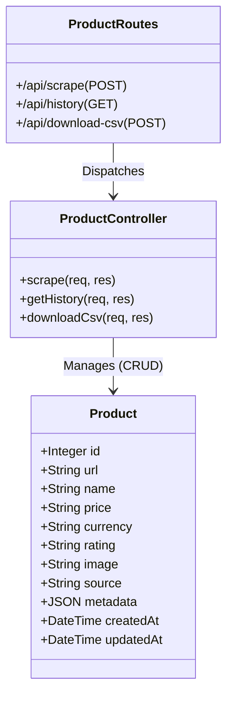
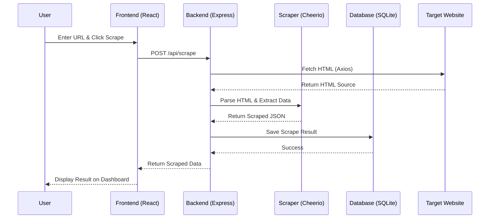

# 🕸️ OmniScrape: Universal Web Scraper V5.0

OmniScrape is a professional-grade, mobile-responsive web scraping application designed to extract product data (Title, Price, etc.) from modern websites. It features a robust backend for data persistence and a sleek, user-friendly dashboard.

## 🎯 Main Goal
The primary objective of this application is to automate the extraction of e-commerce data. It simplifies the process of tracking prices and product details across multiple URLs, saving time and providing a structured history of all scraping activities.

---

## 🛠️ Technology Stack

### **Frontend (The Interface)**
- **React.js**: A powerful UI library for building dynamic user interfaces.
- **Vite**: A lightning-fast build tool for modern web development.
- **Lucide-React**: Premium icon library for a modern, intuitive UI.
- **Vanilla CSS**: Custom-crafted Design System with Glassmorphism and Mobile Responsiveness.

### **Backend (The Engine)**
- **Node.js & Express**: A scalable server environment.
- **Cheerio**: Optimized tool for parsing HTML and extracting data (like "Smart Scraper").
- **Sequelize (ORM)**: For structured communication with the database.

### **Database (The Storage)**
- **SQLite**: A self-contained, high-performance database engine. No external setup required!
- **Persistent History**: Keeps track of every scrape, time-stamped for easy reference.

---

## ⚙️ Detailed Working

1.  **Request Phase**: The user enters a URL (or multiple URLs in Bulk Mode) into the "New Scrape" page.
2.  **Scraping Phase**: The backend server fetches the raw HTML. The **Smart Scraper** logic analyzes the code to find hidden product names and prices using common attribute patterns.
3.  **Persistence Phase**: Once data is found, it is automatically saved into the `database.sqlite` file via our MVC (Model-View-Controller) architecture.
4.  **Dashboard Phase**: The frontend fetches these records to display statistics (Total Scrapes, Success Rate) and a "Recent Activity" table.
5.  **Export Phase**: Users can download their history as a **CSV file** for use in Excel or Google Sheets.

---

## 🌐 Global & Cloud Access
The software is fully prepared for the world:
- **Cloud Deployment**: Hosted on [Render](https://render.com) for 24/7 availability.
- **Mobile Friendly**: Uses CSS Media Queries to adapt perfectly to mobile phones and tablets.
- **Unified Serving**: The backend server is configured to serve the production frontend assets, allowing the entire app to run on a single domain.

---

## �️ Development Environment & Tooling

### **System Information**
- **Operating System**: Windows 10/11 (Development & Deployment Environment).
- **RAM**: Developed on a system with 8GB/16GB (Standard performance profile for Node.js development).
- **Environment**: Node.js v24.13.0 Runtime.

### **Testing & Development Tools**
- **Manual Testing**: Used the **OmniScrape Dashboard** directly to verify end-to-end flows.
- **API Testing**: Performed via **Terminal commands (curl)** and custom script verification (`test_backend.js`) instead of external GUI tools like Postman to ensure rapid iteration.
- **Tunneling**: Used **OpenSSH** and **localhost.run** for real-time global access testing.
- **Version Control**: Git (hosted on GitHub) for deployment and tracking.

---

## 📊 UML Diagrams

### **1. System Architecture Diagram**
Visualizes the flow between the user, the cloud-hosted unified server, and the target websites.

```mermaid
graph TD
    User([User / Friend's Device])
    Internet((Internet / Cloud))
    
    subgraph "Render Cloud (Unified Server)"
        Frontend[React Frontend - UI]
        Backend[Node.js / Express Backend]
        DB[(SQLite Database)]
    end
    
    Target[Target Website (Amazon/eBay etc.)]
    
    User <-->|HTTPS| Internet
    Internet <-->|Unified Root| Frontend
    Frontend <-->|API Requests| Backend
    Backend <-->|Sequelize| DB
    Backend <-->|Axios / Cheerio| Target
```

### **2. Class Diagram**
Shows the structure of the data model and the controller logic.



### **3. Sequence Diagram (The Scrape Flow)**
Shows the step-by-step process of a single scraping request.



---

## 📂 Project Structure
```text
web-scraper-task/
├── backend/
│   ├── src/           # MVC Logic (Models, Routes, Controllers)
│   ├── dist/          # Built Frontend (for production)
│   ├── database.sqlite # Your Data
│   └── server.js      # Main Server Entry
├── frontend/          # React Source Code
└── README.md          # You are here!
```

---

## 🚀 How to Run Locally
1. Navigate to `/backend`
2. Run `npm install`
3. Run `npm start`
4. Visit `http://localhost:5000`

---

**Developed with ❤️ and Advanced AI.**
